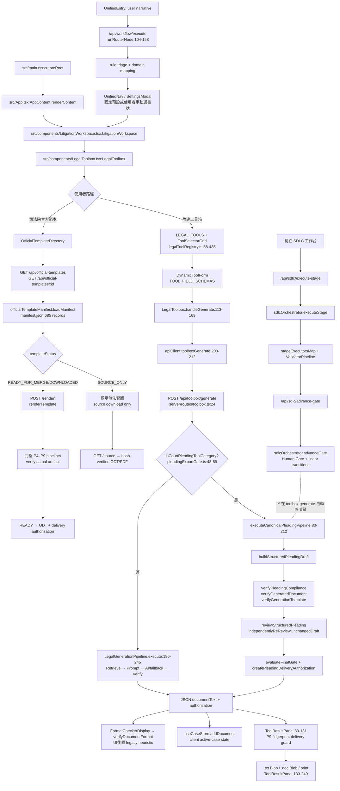

# 使用者輸入到最終書狀檔案：架構追蹤報告

- 審查日期：2026-09-21
- 審查模式：`SINGLE_AGENT_MODE`；本報告依目前 checkout 的實際程式碼追蹤。
- 證據標記：`FACT` = 檔案／行號／測試直接證明；`INFERENCE` = 由多個直接證據推導；`UNKNOWN` = 目前程式碼無法確認。
- 本次未修改產品程式碼。工作樹原有未提交變更保留不動。

## 先給結論

目前存在兩條彼此分離的產出路徑：

1. **內建工具箱路徑**：`LegalToolbox` 讓使用者選擇 `LEGAL_TOOLS` 中的工具，送到 `POST /api/toolbox/generate`。法院書狀類別會進入 `executeCanonicalPleadingPipeline`，通過 P4–P9 確定性管線後回傳**純文字**；前端再提供 `.txt`、相容 Word HTML 的 `.doc`、複製與列印。這條路徑不會自動讀取 `data/official-templates/manifest.json`。
2. **司法院官方範本路徑**：使用者切換「司法院官方範本」後，`OfficialTemplateDirectory` 直接讀取 `/api/official-templates`，選取 manifest 中的單一範本。`SOURCE_ONLY` 會只允許下載來源檔；具備 template status 與 P9 metadata 的範本才呼叫 `/render`，並在完整 P4–P9 pipeline READY 後回傳 ODT 與 delivery authorization；未核准範本仍 fail-closed。

`src/domain/workflow` 的六階段 SDLC 是**另一個獨立工作台與 API**（`/api/sdlc/*`），不是 `POST /api/toolbox/generate` 的內嵌節點。除非使用者另行進入 SDLC 工作台並逐階段執行／人工 Gate，否則工具箱書狀生成不會經過 `sdlcOrchestrator`。

## 1. 呼叫鏈清單

### A. 主要內建工具箱／法院書狀路徑

| 順序 | 實際檔案與行號 | 函式／元件 | 實際行為 |
|---:|---|---|---|
| 1 | `src/main.tsx:6-10` | `createRoot(<App />)` | React 入口。 |
| 2 | `src/App.tsx:25-79` | `AppContent.renderContent` | `activeTool === 'litigation'/'legalToolbox'` 時掛載 `LitigationWorkspace`；`unified` 時掛載 `UnifiedEntry`。 |
| 3 | `src/components/LitigationWorkspace.tsx:24-29,31-52,109-112` | `LitigationWorkspace` | 決定 toolbox tab，將 `initialToolId`、`initialFacts` 傳給 `LegalToolbox`。 |
| 4 | `src/components/LegalToolbox.tsx:27-47` | `LegalToolbox` 初始化 state | `initialToolId` 只有在 `LEGAL_TOOLS.some(tool.id === initialToolId)` 時採用；否則預設 `CRIMINAL_COMPLAINT_TRAFFIC`。`initialFacts` 只填入 `incidentDetails`。 |
| 5 | `src/components/LegalToolbox.tsx:66-81,292-302` | `filteredTools`、`ToolSelectorGrid` | 依使用者選的群組／搜尋文字過濾 registry；使用者點選工具後設定 `activeToolId`。官方群組被排除在這個 registry grid。 |
| 6 | `src/components/LegalToolbox.tsx:345-355` | `DynamicToolForm` + `handleGenerate` | 使用者填表後點「一鍵生成」；`handleGenerate` 收集 `TOOL_FIELD_SCHEMAS[submittedToolId]` 對應欄位。 |
| 7 | `src/components/LegalToolbox.tsx:113-169` | `handleGenerate` | 呼叫 `apiClient.toolboxGenerate({ toolCategory, params })`；回應後執行前端 `evaluatePleadingDelivery(..., 'RETURN')`，成功才放入結果與 case store。 |
| 8 | `src/lib/apiClient.ts:203-212` | `apiClient.toolboxGenerate` | `POST /api/toolbox/generate`，body 為 `{ toolCategory, params }`。 |
| 9 | `server/index.ts:70-88` | Express route registration | 掛載 `toolboxRouter`；另行掛載 `officialTemplatesRouter` 與 `/api/sdlc`。 |
| 10 | `server/routes/toolbox.ts:24-45` | `POST /api/toolbox/generate` | 將 `toolCategory || toolId` 正規化為大寫，確認它存在於 `LEGAL_TOOLS` 或 legacy title map；標題由 server registry 決定。 |
| 11 | `server/routes/toolbox.ts:48-58` | citation gate + `precheckLegalInput` | 先阻擋未讀取全文的候選裁判，再做法律輸入前置檢查；reject 時回 HTTP 422。 |
| 12 | `server/routes/toolbox.ts:60-75` | `evaluatePleadingDelivery` | 對法院書狀要求 server-owned P9 授權；未取得授權時不接受 client 自帶 gate 資料。非法院書狀則走 legacy AI generation。 |
| 13A | `server/routes/toolbox.ts:78-90` | `isCourtPleadingToolCategory` → `executeCanonicalPleadingPipeline` | 法院書狀直接進 canonical P4–P9 管線；錯誤回 HTTP 422，**不 fallback 到官方 manifest 或另一個 registry 工具**。 |
| 14A | `server/services/canonicalPleadingPipeline.ts:80-122` | `executeCanonicalPleadingPipeline` 前半 | `getCourtPleadingConfig(categoryKey)` 取得規則設定；把 `params` 映射成 `CaseInput`、parties、claims、facts、evidence、attachments。 |
| 15A | `server/services/canonicalPleadingPipeline.ts:124-138` | `buildStructuredPleadingDraft` + blocking input check | 先產生結構化草稿；缺少 `BLOCKING/HIGH` 欄位即丟 `CanonicalPleadingInputError`，不產出。 |
| 16A | `server/services/canonicalPleadingPipeline.ts:140-157` | compliance／citation／format／review | 依序執行 `verifyPleadingCompliance`、`verifyGeneratedDocument`、`verifyGenerationTemplate`，再執行 `reviewStructuredPleading`。 |
| 17A | `server/services/canonicalPleadingPipeline.ts:158-185` | re-review + final gate | `MISSING/CONFLICT/UNVERIFIED` 阻擋；接著 `independentlyReReviewUnchangedDraft`、`evaluateFinalGate`。非 `READY` 即阻擋。 |
| 18A | `server/services/canonicalPleadingPipeline.ts:187-212` | document assembly + authorization | 將 draft sections 組成 `documentText`，建立 `createPleadingDeliveryAuthorization`，回傳純文字、P9 authorization、合規清單與引用狀態。 |
| 13B | `server/routes/toolbox.ts:93-140` | `defaultLegalGenerationPipeline.execute` | 非法院書狀工具走 Retrieve → Prompt → AI/fallback → `verifyGeneratedDocument`；production fallback 可能被 `blockProductionToolboxFallback` 阻擋。 |
| 14B | `server/services/legalGenerationPipeline.ts:196-245` | `LegalGenerationPipeline.execute` | 先 `retrieveContext`，再附加 `UNIVERSAL_SYLLOGISM_RULES`，呼叫 AI，最後 `verifyGeneratedDocument(... allowedCitations)` 與 `assertGeneratedDocumentVerified`。 |
| 19 | `src/components/LegalToolbox.tsx:143-153` | `useCaseStore.addDocument` | 只把回傳的 `documentText` 存進目前瀏覽器記憶體中的 active case；`status` 依 ghost citation 設為 `NEEDS_HUMAN_REVIEW` 或 `VERIFIED`。 |
| 20 | `src/components/toolbox/ToolResultPanel.tsx:30-49,86-131` | `verifyPleadingDeliveryAuthorization` + render guard | 前端再次核對授權內容 fingerprint；法院書狀若不是 P9 READY，不顯示正文、複製、下載或列印。 |
| 21 | `src/components/toolbox/ToolResultPanel.tsx:133-155,157-211,213-249` | `handleCopy`、`handleDownloadTxt`、`handleDownloadDoc`、`handlePrint` | 產出位置是瀏覽器端：`.txt` Blob、HTML 相容 `.doc` Blob，或新視窗列印；沒有 server-side 生成檔案儲存。 |
| 22 | `src/components/toolbox/FormatCheckerDisplay.tsx:9-10` → `src/lib/formatChecker.ts:43-162` | `verifyDocumentFormat` | 結果顯示後才在 UI 執行的 legacy 文字指標檢查；不是 canonical 產生前或產生中 gate。 |

### B. UnifiedEntry「先輸入案情、再進書狀」路徑

這條路徑的分類／分析與實際書狀產生是兩次操作：

1. `src/components/UnifiedEntry.tsx:243-297` 的 `handleExecuteWorkflow` 將使用者敘述送到 `/api/workflow/execute`；失敗時改用同檔 `executeLocalFallbackWorkflow:147-240`。
2. `server/routes/unifiedWorkflow.ts:104-158` 的 `runRouterNode` 呼叫 `buildIntelligentRuleBasedTriage`、`enforceTriageConsistency`、`detectTemporalConflict`，再依 `triage.caseType/category/isSensitive` 映射 `domain`。
3. `src/components/unified/UnifiedNav.tsx:19-39` 的 `defaultDocumentTool` 只有二選一：`domain === '刑事'` → `CRIMINAL_COMPLAINT_TRAFFIC`，否則 → `CIVIL_COMPLAINT_GENERAL`；這不是完整的 32/37 工具分類模型。
4. 使用者按「選擇書狀類型」後，`src/components/unified/SettingsModal.tsx:24-123` 由使用者手動選存證信函、民事起訴狀、刑事告訴狀、官方刑事範本等；它把原始 `workflowState.userNarrative` 作為 `facts` 傳入 toolbox。
5. 因此 `UnifiedEntry` 本身不直接產出最終書狀檔案；最終仍回到 A 路徑的 `LegalToolbox.handleGenerate`。分類來源是**規則式 triage + 固定 UI 選項／預設值**，不是一個會自動選定官方 685 筆範本的分類器。

### C. 司法院官方 685 筆範本路徑

| 順序 | 實際檔案與行號 | 函式／元件 | 實際行為 |
|---:|---|---|---|
| 1 | `src/components/LegalToolbox.tsx:90-105,283-285` | `handleGroupSelect` / `OfficialTemplateDirectory` | 使用者切換 `OFFICIAL_TEMPLATES` 後，畫面切換成官方範本目錄；不呼叫 `/api/toolbox/generate`。 |
| 2 | `src/components/toolbox/OfficialTemplateDirectory.tsx:51-62` | mount `useEffect` | `GET /api/official-templates` 載入分類摘要。 |
| 3 | `src/components/toolbox/OfficialTemplateDirectory.tsx:64-78` | category `useEffect` | 使用者選分類後，`GET /api/official-templates?category=...`。 |
| 4 | `src/components/toolbox/OfficialTemplateDirectory.tsx:80-94` | `handleSelectTemplate` | 使用者點選單一範本後，`GET /api/official-templates/:id` 取得欄位與 `templateStatus`。 |
| 5 | `server/routes/officialTemplates.ts:28-74,80-108` | list/detail routes | `loadManifest` 讀 `data/official-templates/manifest.json`；以 category/id 查找，不依案情關鍵字自動匹配。 |
| 6 | `src/components/toolbox/OfficialTemplateDirectory.tsx:209-287` | status UI | `SOURCE_ONLY` 顯示只能下載官方來源；`READY_FOR_MERGE` 才顯示欄位表單；其他狀態顯示暫時無法套版。 |
| 7 | `src/components/toolbox/OfficialTemplateDirectory.tsx:96-129` | `handleRender` | 使用者填欄位後 POST `/api/official-templates/:id/render`；若 server 真正回 documentBase64，前端會轉 ODT Blob 並下載。 |
| 8 | `server/routes/officialTemplates.ts:160-226` | render route | `SOURCE_ONLY`、`OUTDATED`、`DOWNLOAD_FAILED` 直接拒絕；具備 P9 metadata 的範本通過 renderer 與完整 P4–P9 pipeline 後回傳 200、ODT base64 與 authorization，未核准則回應對應 gate error。 |
| 9 | `src/lib/officialTemplateRenderer.ts:327-380` | `renderTemplate` | 只允許 `READY_FOR_MERGE` 或 `DOWNLOADED`，檢查本機 ODT、必要欄位與欄位位置，最後產生新的 ODT bytes。 |
| 10 | `server/routes/officialTemplates.ts:115-153` → `OfficialTemplateDirectory.ts:131-153` | source download | 對有 `localFilePath/localFileHash` 的來源檔做 SHA-256 比對後，以原始 ODT/PDF attachment 回傳；這不是套版書狀。 |

## 2. 案由／類型分類邏輯

### 直接進工具箱

`LegalToolbox` 沒有讀取自由文字後自動判斷案由再挑工具的程式。`activeToolId` 來源是：

- `initialToolId` 經 `LEGAL_TOOLS` membership 檢查：`src/components/LegalToolbox.tsx:33-36`。
- 使用者在 `ToolSelectorGrid` 手動點選：`src/components/LegalToolbox.tsx:292-302`。
- 試算器把結果帶入文件時，`handleSendClauseToDocument` 以 `switch(activeToolId)` 與 category group 硬編碼選目標文件：`src/components/LegalToolbox.tsx:207-267`。

所以這段是**使用者手動選擇 + if/switch 硬編碼映射**，不是 AI 分類。

### Unified／導診入口

- `server/routes/unifiedWorkflow.ts:104-158`：主要是 `buildIntelligentRuleBasedTriage` 的規則式 triage，再加一致性與時間矛盾檢查。
- `server/routes/triage.ts:26-68,70-122`：另一個 `/api/triage/universal` 路徑會把 `LEGAL_TOOLS` 摘要放入 AI prompt，要求 AI 回傳 `category`／`recommendedToolId`，然後以 `enforceTriageConsistency` 做一致性處理；目前已追到的是導診輸出，未追到它自動呼叫 `/api/toolbox/generate` 的直接 caller。
- `src/lib/classifier.ts:6-29`：`classifyJudgment` 是判決／上訴分析用的關鍵字 classifier，不是 LegalToolbox 書狀選擇器。
- `src/lib/legalProcessClassifier.ts:81-109,115-210`：敏感／家暴／性侵流程的關鍵字與表單特徵規則；會產生 `recommendedPaths.targetToolId`，但仍需前端導航／使用者後續操作。

## 3. 內建 registry 與官方 manifest 的實際關係

### 內建 registry

- `src/lib/legalToolRegistry.ts:58-435` 目前有 **37 個 `id` 定義**：5 個 `JUDICIAL_*_TEMPLATE` 入口描述 + 32 個其他工具／產生器／試算器。
- `src/lib/legalToolRegistry.ts:437-447` 另有只含 7 個 ID 的 `TOOLBOX_TOOLS` subset；但本次主流程的 `LegalToolbox` 與 server 驗證實際使用的是 `LEGAL_TOOLS`，不可把 7 個 subset 誤當成完整 registry 數量。
- 因此「32 種內建範本」若指非 `JUDICIAL_*` 的 32 個 registry entries，與目前程式碼相符；但它們不是官方 manifest 的 685 筆 ODT 範本。

### 官方 manifest

- `src/lib/officialTemplateManifest.ts:9-25` 直接讀取 `data/official-templates/manifest.json`，`totalTemplates = raw.length`。
- 本次現場解析檔案結果：`raw.length = 685`；`templateStatus` 分布為 **655 `NEEDS_FIELD_MAPPING`、30 `DOWNLOADED`**。
- `data/official-templates/manifest.json` 目前沒有 `SOURCE_ONLY` 或 `READY_FOR_MERGE` 記錄。這與「685 筆裡 1 筆可套、其餘 SOURCE_ONLY」的前提矛盾，應以目前 checkout 為準；如使用者指的是另一個 branch／部署 artifact，需人工提供該版本 hash 或檔案確認。

### 是否有自動二選一？

沒有找到 `LEGAL_TOOLS` → manifest 的自動 resolver。`JUDICIAL_*_TEMPLATE` 只是 registry 中的 5 個 UI／分類描述，真正官方目錄由 `OfficialTemplateDirectory` 直接呼叫 `/api/official-templates`。因此「套內建或套官方」是**使用者介面路徑選擇**，不是案情分類後的自動分支。

## 4. `SOURCE_ONLY` 時實際行為

以程式碼定義（即使目前 manifest 沒有該狀態）可確認：

1. 前端 `OfficialTemplateDirectory.tsx:209-213` 顯示「無法線上套版」，指向官方詳細頁；不顯示線上套版表單。
2. 若直接呼叫 `POST /api/official-templates/:id/render`，`server/routes/officialTemplates.ts:167-171` 回 HTTP 422、`TEMPLATE_SOURCE_ONLY`。
3. 不會 fallback 到 `LEGAL_TOOLS` 內建產生器；程式碼沒有這個 fallback call。
4. 若該 template 有完整本機來源與 hash，使用者可按 `source` endpoint 下載原始檔；`server/routes/officialTemplates.ts:121-149` 會檢查路徑、格式與 SHA-256。

## 5. SDLC 六階段治理引擎介入點

### 實際 SDLC 工作台路徑

1. `src/components/LegalSdlcWorkbench.tsx` 呼叫 `apiClient.sdlcGetProject`／`sdlcExecuteStage`／`sdlcAdvanceGate`（此為獨立工作台）。
2. `src/lib/apiClient.ts:224-260` 呼叫 `/api/sdlc/project`、`/api/sdlc/execute-stage`、`/api/sdlc/advance-gate`。
3. `server/routes/sdlc.ts:224-263` 把階段執行委派給 `defaultSdlcOrchestrator.executeStage`。
4. `src/domain/workflow/sdlcOrchestrator.ts:71-158`：先 `AuthorizationPolicy.assertPermission(..., 'GENERATE')`，選 `stageExecutorsMap[stageId]`，執行 AI 與 `ValidatorPipeline`，再保存 artifact。
5. `src/domain/workflow/stageExecutors.ts:32-82`：prompt 建立、AI 生成、`ValidatorPipeline.runAll`；AI 失敗轉為 `FALLBACK` 並給 `FAIL`，不可冒充成功。
6. `server/routes/sdlc.ts:265-299` → `sdlcOrchestrator.advanceGate`；`src/domain/workflow/sdlcOrchestrator.ts:163-321` 強制 Human Gate、artifact／validator 覆蓋率、execution mode、線性 stage transition。

### 在本次「工具箱到書狀」主路徑的位置

`UNKNOWN/FACT` 結論：目前沒有 `toolbox.ts` → `sdlcOrchestrator` 的呼叫。工具箱主路徑使用自己的 canonical P4–P9 模組（`canonicalPleadingPipeline.ts:124-191`），而不是 `src/domain/workflow/stageExecutors.ts` 的六階段 executor。因此不能把兩套治理引擎畫成同一條自動呼叫鏈。

## 6. 內容生成與校驗的時間點

| 時間點 | 實際模組 | 判定 |
|---|---|---|
| 生成前 | `server/routes/toolbox.ts:48-58` 的 `findUnreadRetrievedCitations`、`precheckLegalInput` | `FACT`：輸入與來源 gate 先執行。 |
| 生成前／生成準備 | `server/services/legalGenerationPipeline.ts:196-205` | `FACT`：legacy AI 路徑先檢索，再組 prompt；`UNIVERSAL_SYLLOGISM_RULES` 附加到 prompt。 |
| 結構化生成後 | `server/services/canonicalPleadingPipeline.ts:124-148` | `FACT`：canonical draft 生成後執行 `verifyPleadingCompliance`、`verifyGeneratedDocument`、`verifyGenerationTemplate`。 |
| AI 生成後 | `server/services/legalGenerationPipeline.ts:211-233` | `FACT`：AI／fallback 回傳後執行 `verifyGeneratedDocument` + `assertGeneratedDocumentVerified`。 |
| UI 顯示後 | `src/components/toolbox/ToolResultPanel.tsx:379` → `FormatCheckerDisplay.tsx:9-10` → `formatChecker.ts:43-162` | `FACT`：legacy `formatChecker` 是結果顯示時才跑的 heuristic 文字指標檢查。 |
| 最終交付前 | `canonicalPleadingPipeline.ts:167-191`、`ToolResultPanel.tsx:30-49,86-131` | `FACT`：independent re-review、P9 Final Gate、authorization fingerprint 再決定是否可回傳／匯出。 |

注意：`formatChecker.ts` 自己明確標註 deprecated，且描述「僅偵測文字指標，未驗證內容正確性」；canonical 合規主體是 `verifyPleadingCompliance` 與 `verifyGenerationTemplate`，不是 legacy `verifyDocumentFormat`。

## 7. 最終輸出格式與儲存／回傳位置

### 內建 toolbox

- server 回傳：`server/services/canonicalPleadingPipeline.ts:193-212` 或 legacy pipeline 的 JSON payload，核心欄位是 `documentText`。
- 前端暫存：`src/components/LegalToolbox.tsx:143-153` 寫入 Zustand `useCaseStore` 的 active case `documents`；`src/store/useCaseStore.ts:86-115` 顯示這是 client state，並沒有在此函式寫 server 檔案。
- 下載：`ToolResultPanel.tsx:142-155` 下載 UTF-8 `.txt`；`157-211` 以 HTML MIME 產生相容 Microsoft Word 的 `.doc`；`213-249` 開新視窗列印。
- `UNKNOWN`：單就 `useCaseStore` 片段無法證明瀏覽器重整後是否由其他 hydration 機制持久化 active case；本報告不把它推測成永久儲存。已確認的交付檔案是瀏覽器端 Blob／列印，不是 server 端永久檔案。

### 官方範本

- 原始來源下載：server 以 ODT/PDF binary attachment 回傳（`officialTemplates.ts:115-153`），前端轉 Blob 下載（`OfficialTemplateDirectory.tsx:131-153`）。
- 套版格式：`renderer` 產生 ODT 後，production route 會執行完整 P4–P9 pipeline；只有 final gate READY 且 delivery authorization 有效時才回傳 ODT 與授權。
- 未核准或 artifact/citation/mapping 驗證失敗時，render route fail-closed，不交付 ODT。

## 8. 架構圖

## 9. 流程判斷點清單

| 判斷點 | 程式位置 | 條件／結果 | 實作型態 |
|---|---|---|---|
| 初始工具是否合法 | `LegalToolbox.tsx:33-36` | `initialToolId` 是否存在於 `LEGAL_TOOLS`；否則預設交通刑事告訴工具 | registry lookup + if/else |
| 官方群組是否顯示 | `LegalToolbox.tsx:66-75,283-285` | `categoryGroup === 'OFFICIAL_TEMPLATES'` 時從內建 grid 排除，改顯示官方目錄 | if/else UI 分支 |
| 試算結果導向何文件 | `LegalToolbox.tsx:207-257` | `activeToolId` switch，部分再依 `categoryGroup` | 硬編碼 switch/if |
| 工具類別是否存在 | `server/routes/toolbox.ts:25-41` | registry ID 或 legacy title key | registry lookup + if |
| 候選裁判是否讀全文 | `server/routes/toolbox.ts:48-50` | 有 unread citation 即 422 | 規則 gate |
| 輸入前置檢查 | `server/routes/toolbox.ts:52-58` | `precheck.status === 'reject'` 即 422 | 規則 gate |
| 是否法院書狀 | `pleadingExportGate.ts:48-89` | 明確 allowlist `Set`，不看 AI、標題或正文 heuristic | 規則表／Set 驅動 |
| P9 是否必須 | `pleadingExportGate.ts:165-200` | 法院書狀沒有 authorization 或 fingerprint 不符即 blocked | if/else + authorization schema |
| 是否進 canonical | `server/routes/toolbox.ts:64-82` | court pleading → canonical；其餘 → legacy pipeline | if/else |
| 是否有 blocking input | `canonicalPleadingPipeline.ts:124-138` | `missingInputs` severity 為 BLOCKING/HIGH 即丟錯 | rule profile + if |
| format profile 是否一致 | `generationTemplateVerifier.ts:26-44` | profile signature JSON 相等才 `COMPLIANT` | 規則表／signature 比對 |
| review 是否可繼續 | `canonicalPleadingPipeline.ts:158-165` | `MISSING/CONFLICT/UNVERIFIED` 任一存在即阻擋 | finding status gate |
| P9 是否 READY | `canonicalPleadingPipeline.ts:174-185` | `finalGateReport.status !== 'READY'` 即阻擋 | final-gate rule engine |
| manifest 範本是否可 render | `officialTemplates.ts:167-185`、`officialTemplateRenderer.ts:336-355` | SOURCE_ONLY／OUTDATED／DOWNLOAD_FAILED／NEEDS_FIELD_MAPPING 均不可正常套版；READY/DOWNLOADED 才進一步處理 | status table + if/else |
| 官方 render 是否回檔 | `officialTemplates.ts:211-226` | 即使文件檢核通過，因缺 P9 trusted report 固定 409 | 硬編碼 fail-closed gate |
| Unified domain 預設文件 | `UnifiedNav.tsx:19-21` | 刑事 → `CRIMINAL_COMPLAINT_TRAFFIC`，其他 → `CIVIL_COMPLAINT_GENERAL` | 二分 if/else |
| Unified triage domain | `unifiedWorkflow.ts:115-141` | rule triage 後依 caseType/sensitive/category 關鍵欄位映射民事／刑事／家事／勞動 | 規則式 classifier + if/else |
| `/api/triage/universal` 的工具推薦 | `server/routes/triage.ts:28-68,70-122` | AI prompt 要求回 `category/recommendedToolId`，再由 consistency layer 處理 | AI JSON + 規則一致性校驗 |
| SDLC 階段選擇 | `sdlcOrchestrator.ts:81-85` | `stageExecutorsMap[stageId]` 是否存在 | map lookup + if |
| SDLC Gate 身分 | `sdlcOrchestrator.ts:169-170` | 必須 `HUMAN` 且具 APPROVE 權限 | authorization rule |
| SDLC 線性轉移 | `sdlcOrchestrator.ts:268-275` | 只允許 stage order 下一階段 | deterministic state machine |

## 10. 不確定／需人工確認

1. **manifest 狀態前提矛盾**：目前檔案是 655 `NEEDS_FIELD_MAPPING` + 30 `DOWNLOADED`，無 `SOURCE_ONLY`／`READY_FOR_MERGE`；若要審查另一版本，需提供該版本的 manifest hash、branch 或部署檔案。
2. **`DOWNLOADED` 是否可實際 render**：renderer 的程式允許 `DOWNLOADED`，但同時要求欄位 mapping、ODT 檔及完整欄位；目前沒有一個 `READY_FOR_MERGE` 實例可供現場驗證完整成功鏈。
3. **server route 的實際 auth／tenant middleware 行為**：本報告只追到 route 呼叫與 route 內的判斷；production trusted identity、部署環境與實際瀏覽器 session 不在本機靜態追蹤範圍。
4. **active case 的跨 reload 持久化**：`useCaseStore.addDocument` 明確是 client Zustand state；目前未把未追到的 hydration 機制推測為永久檔案儲存。
5. **Unified `/api/triage/universal` 到最終產檔的直接 caller**：已確認 triage 會輸出 `recommendedToolId`，但在本 repo 靜態搜尋中未找到它直接呼叫 `/api/toolbox/generate`；目前可確認的最終產檔路徑是使用者再進入 toolbox 後的 A 路徑。
6. **SDLC artifact 是否等同 LegalToolbox 的正式書狀檔案**：程式碼顯示它可產出 `code_or_doc`／release artifact，但沒有連到 toolbox 的 `documentText`／ODT 下載流程；不得把兩者宣稱為同一產出物。

## 11. 最小審查摘要

- `FACT`：內建法院書狀目前由 canonical P4–P9 產出純文字，P9 authorization 才允許前端顯示／匯出。
- `FACT`：官方範本目錄與內建工具箱是兩條 UI/API 路徑；沒有自動 fallback 或自動二選一 resolver。
- `FACT`：`formatChecker.ts` 是結果顯示後的 deprecated heuristic adapter；canonical path 另有 compliance、format profile、review、re-review、P9 gate。
- `FACT`：官方 render route 目前即使完成 ODT render 與文件檢核，也固定因缺 trusted P9 report 回 409。
- `UNKNOWN`：目前 checkout 之外的 manifest 狀態、production runtime 與 active-case reload 持久化，需另外取得部署／版本證據。
